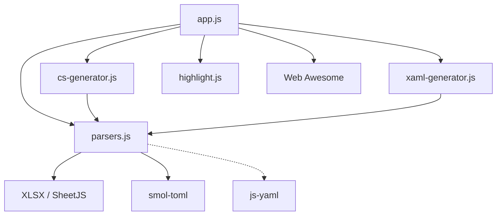
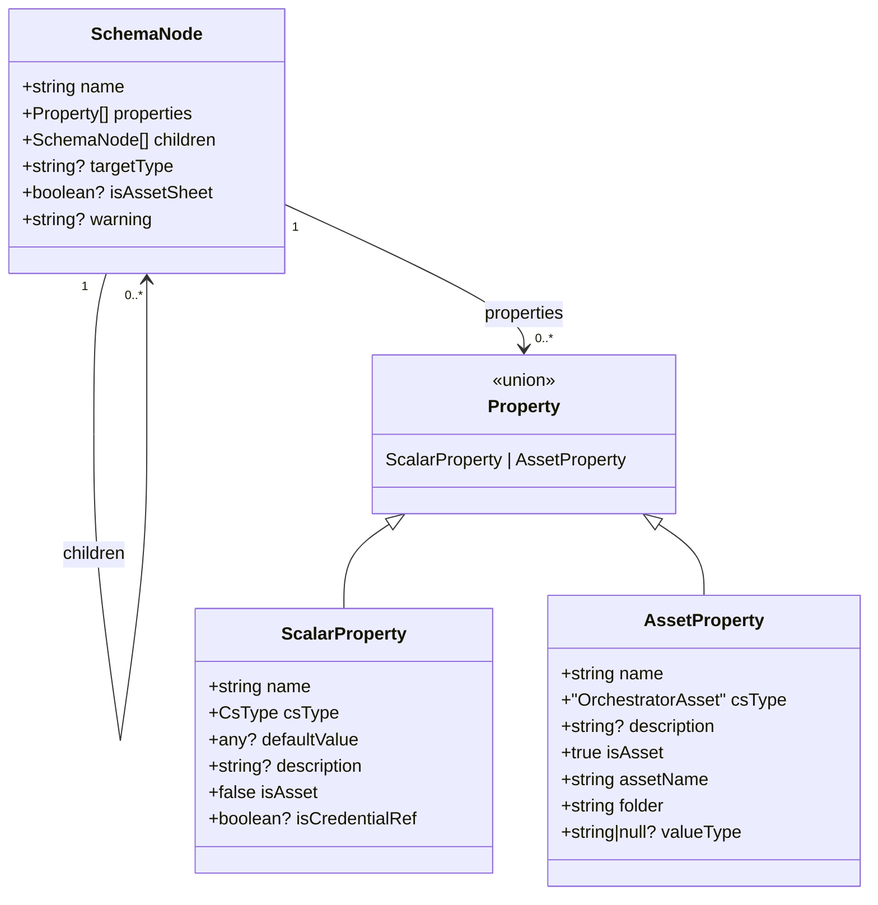

# Developer Reference

FAQ-style answers to common questions about the ConFigTree generator.
Tables between `BEGIN AUTO` / `END AUTO` fences are regenerated from source — do not hand-edit.

## Code size

How much code is there, and where does it live?

<!-- BEGIN AUTO: loc -->
| File | Lines | Category |
|---|--:|---|
| `public/js/app.js` | 499 | app (UI glue) |
| `public/js/cs-generator.js` | 578 | app (C# emitter) |
| `public/js/parsers.js` | 546 | app (xlsx/json/toml parsers) |
| `public/js/xaml-generator.js` | 209 | app (XAML emitter) |
| `public/js/version.js` | 1 | app (version stamp) |
| `public/index.html` | 198 | UI |
| `public/css/app.css` | 410 | UI |
| `public/slides/getting-started/index.html` | 777 | content (tutorial) |
| `test/run-generators.mjs` | 360 | tests (golden runner) |
| `test/fixtures/generate_fixtures.py` | 724 | tests (fixture generator) |
| **App code (JS)** | **1833** | |
| **UI (HTML + CSS)** | **608** | |
| **Tests** | **1084** | |
| **Total (excl. vendor)** | **4302** | |

Excluded: `public/vendor/xlsx-0.20.3.js` (minified SheetJS, 951 KB / 24 lines).
<!-- END AUTO: loc -->

## Functions per JS file

How many top-level functions does each JS module implement? (Counts `function name(…)` declarations at column 0; inline arrow functions and nested helpers are not counted.)

<!-- BEGIN AUTO: functions -->
| File | Functions |
|---|--:|
| `public/js/app.js` | 18 |
| `public/js/parsers.js` | 14 |
| `public/js/cs-generator.js` | 9 |
| `public/js/xaml-generator.js` | 5 |
| `public/js/version.js` | 0 |
| **Total** | **46** |
<!-- END AUTO: functions -->

## Architecture

### Data flow — from uploaded file to generated output

```mermaid
flowchart LR
    User([User uploads file]) --> Handle[app.js<br/>handleFile]
    Handle --> Dispatch{extension?}
    Dispatch -->|.xlsx| Xlsx[parsers.js<br/>mapSheet]
    Dispatch -->|.json| Json[parsers.js<br/>parseJson]
    Dispatch -->|.toml| Toml[parsers.js<br/>parseToml]
    Dispatch -->|.yaml / .yml| Yaml[parsers.js<br/>parseYaml]
    Xlsx --> IR[(SchemaNode&#91;&#93;)]
    Json --> IR
    Toml --> IR
    Yaml --> IR
    IR --> Cs[cs-generator.js<br/>generateCSharp]
    IR --> Xaml[xaml-generator.js<br/>generateXamlSnippet]
    Cs --> OutCs[".cs output tab"]
    Xaml --> OutXaml[".xaml output tab"]
```



### Module dependencies — who imports what

Solid arrows are runtime dependencies; dashed arrows are optional (only used when the feature is triggered).



### IR type structure — SchemaNode and Property shapes

The IR is the contract between parsers and generators. Every parser produces `SchemaNode[]`; every generator consumes it.



## File overview

Javadoc-style summary of every JS source file. Each subsection mirrors the file's `@file` JSDoc block and lists its top-level functions.

| File | Purpose |
|---|---|
| `public/js/parsers.js` | Parsers: xlsx / JSON / TOML / YAML → SchemaNode IR |
| `public/js/cs-generator.js` | Emits C# source from SchemaNode IR |
| `public/js/xaml-generator.js` | Emits UiPath ClipboardData XAML snippet |
| `public/js/app.js` | Browser UI controller |

---

### `public/js/parsers.js`

**Purpose.** Parsers that turn input config files (xlsx / JSON / TOML / YAML) into the shared SchemaNode IR.

| | |
|---|---|
| **Exports** | `mapSheet`, `readMetaSheet`, `nodeHasAssets`, `parseJson`, `parseToml`, `readTomlMeta`, `parseYaml`, `escapeXml` |
| **Consumes** | global `XLSX` (SheetJS), global `TOML` (smol-toml), global `jsyaml` (js-yaml, optional) |
| **Produces** | `SchemaNode[]` and `MetaOverrides` |
| **Related** | (raw file) → `parsers.js` → `cs-generator.js`, `xaml-generator.js`, `app.js` |

#### Functions

| Function | Summary |
|---|---|
| `mapSheet` | Convert one xlsx sheet into a SchemaNode. |
| `getCellWithType` | Inspect a cell and return `{ value, csType }`, inferring type from SheetJS `cell.t`. |
| `nodeHasAssets` | Return true if the node or any descendant has an asset property. |
| `readMetaSheet` | Read a `_Meta` sheet as a flat key/value override map, or null if absent. |
| `parseToml` | Parse TOML text into SchemaNodes; flat scalars roll up under a "Settings" node. |
| `parseTomlNode` | Recursively convert one TOML table into a SchemaNode. |
| `readTomlMeta` | Read a top-level `[_meta]` table as an override map, or null if absent. |
| `inferTomlCsType` | Map a TOML scalar (including smol-toml typed date/time objects) to a CsType. |
| `parseYaml` | Parse YAML text into SchemaNodes (reuses the JSON node walker). |
| `parseJson` | Parse JSON text into SchemaNodes. |
| `parseJsonNode` | Recursively convert one JSON object into a SchemaNode. |
| `inferCsType` | Map a JSON/YAML scalar to a CsType; recognises ISO date/time string patterns. |
| `inferDateCsType` | Classify a Date into DateOnly / DateTime / TimeOnly based on UTC components. |
| `escapeXml` | Escape `& < > "` for safe embedding in XML attributes or text. |

#### Typedefs (IR contract)

| Name | Description |
|---|---|
| `CsType` | C# scalar type union: `string \| int \| double \| bool \| DateOnly \| DateTime \| TimeOnly \| OrchestratorAsset`. |
| `SourceFormat` | `xlsx \| json \| toml \| yaml`. |
| `ScalarProperty` | Regular property with optional default value. |
| `AssetProperty` | Orchestrator asset reference with `assetName`, `folder`, `valueType`. |
| `Property` | Union `ScalarProperty \| AssetProperty`. |
| `SchemaNode` | Top-level IR node — `name`, `properties`, `children`, optional `targetType` / `isAssetSheet` / `warning`. |
| `MetaOverrides` | Partial override map for CONFIG_DEFAULTS keys. |

---

### `public/js/cs-generator.js`

**Purpose.** Emits complete C# source — root aggregator class plus one class per SchemaNode — from the IR.

| | |
|---|---|
| **Exports** | `generateCSharp` |
| **Consumes** | `SchemaNode[]` (from `parsers.js`), global `config` (from `app.js`), global `CONFORMMOLD_VERSION`, global `escapeXml` |
| **Produces** | `string` (a full `.cs` file) |
| **Related** | `parsers.js` → `cs-generator.js` → `app.js` (renders into the "C#" output tab) |

#### Functions

| Function | Summary |
|---|---|
| `CodeWriter` (class) | Indentation-aware string builder used by the C# emitter. |
| `generateCSharp` | Emit C# source for the root aggregator class plus one class per SchemaNode. |
| `emitClass` | Recursively emit one C# class — including FromDataTable / ToXxx / ToString as applicable. |
| `collectSchemaPaths` | Collect `"Section.Path" → key list` entries for the Schema manifest. |
| `toClassName` | Convert a sheet/section name into a PascalCase `…Config` class name. |
| `toPascalCase` | Normalize an identifier by splitting on `_ - . whitespace` and PascalCasing parts. |
| `defaultInitializer` | Emit the C# ` = value` suffix for a property given its CsType and default. |

---

### `public/js/xaml-generator.js`

**Purpose.** Emits a UiPath ClipboardData XAML snippet that loads the generated config at runtime.

| | |
|---|---|
| **Exports** | `generateXamlSnippet` |
| **Consumes** | `SchemaNode[]` (from `parsers.js`), global `config`, global `lastSourceFormat` (both from `app.js`) |
| **Produces** | `string` (ClipboardData XML, ready to paste into a UiPath workflow) |
| **Related** | `parsers.js` → `xaml-generator.js` → `app.js` (renders into the "XAML" output tab) |

#### Functions

| Function | Summary |
|---|---|
| `generateXamlSnippet` | Emit a UiPath ClipboardData XAML snippet with the Load call and any asset blocks. |
| `collectAssetProps` | Walk the tree and collect `{ path, prop }` for every asset property. |
| `xamlSingleAsset` | Emit one TryCatch / GetRobotAsset / Assign block for a single asset. |
| `xamlAssign` | Emit a minimal `<p:Assign>` activity XML string. |
| `xamlEnvelope` | Wrap activity XML in the ClipboardData envelope with conditionally-included namespaces. |

---

### `public/js/app.js`

**Purpose.** Browser UI controller — file picker, config persistence, sheet selection, output rendering.

| | |
|---|---|
| **Exports** | none (classic browser script; runs on `DOMContentLoaded`) |
| **Consumes** | `parsers.js`, `cs-generator.js`, `xaml-generator.js`, Web Awesome custom elements, highlight.js, `localStorage` |
| **Produces** | DOM updates and persisted config under key `"configtree.config"` |
| **Related** | (user file) → `app.js` → `parsers.js` → generators → `app.js` output tabs |

#### Functions

| Function | Summary |
|---|---|
| `loadConfig` | Load persisted config from localStorage, merged over CONFIG_DEFAULTS values. |
| `saveConfig` | Persist the current `config` object to localStorage. |
| `setConfigValue` | Set `config[key]` and sync the corresponding DOM input. |
| `initSettings` | Wire every CONFIG_DEFAULTS entry to its DOM input; input events persist to localStorage. |
| `resetConfigToStored` | Revert all UI inputs to the last persisted config, discarding per-file meta overrides. |
| `applyMetaOverrides` | Overlay `_Meta` / `[_meta]` values onto the in-memory config + UI. |
| `handleFile` | Dispatch on file extension to the right parser and wire FileReader callbacks. |
| `onNodesLoaded` | Post-parse pipeline: apply meta overrides, render the sheet picker, regenerate output. |
| `onWorkbookLoaded` | Legacy xlsx entry point retained for the existing FORMAT_PARSERS path. |
| `regenerateFromSelection` | Re-run the generators using the currently-checked sheets. |
| `renderSheetSelection` | Render a checkbox list of sheets, tagging asset sheets with a badge. |
| `selectedSheets` | Return the subset of `lastSheets` whose checkbox is checked. |
| `clearSheetSelection` | Empty the sheet checkbox UI and hide the container. |
| `showWarning` | Append a `<wa-alert variant="warning">` to `#warnings`. |
| `clearWarnings` | Empty the `#warnings` container. |
| `onSheetsReady` | Generate C# + XAML from selected sheets, update the output tabs, and run hljs highlighting. |

## Input format: `.xlsx`

How types are derived from cells, and which directives / columns influence the output.

### Sheet shapes

Each sheet becomes one `SchemaNode` (one C# class). Two schemas are detected from the header row:

| Schema | Trigger (header row) | Column layout |
|---|---|---|
| Standard sheet | col B header is anything other than `asset` | A = Name, B = Value, C = Description, plus optional `ValueType` / `DataType` columns anywhere |
| Asset sheet | col B header is `asset` (case-insensitive) | A = Name, B = AssetName, C = Folder, D = Description, plus optional `ValueType` column anywhere |

Sheet names beginning with `_` are excluded from code generation. `_Meta` (case-insensitive) is consumed as a per-file CONFIG_DEFAULTS override map.

### Standard sheet: type inference from the Value cell

`getCellWithType` inspects the SheetJS cell tag (`cell.t`):

| Cell | Condition | CsType |
|---|---|---|
| `b` (boolean) | — | `bool` |
| `n` (number) | integer | `int` |
| `n` (number) | fractional | `double` |
| `d` (date) | year < 1900 (time-only serial) | `TimeOnly` |
| `d` (date) | has non-zero UTC hours/minutes/seconds | `DateTime` |
| `d` (date) | midnight UTC | `DateOnly` |
| `s` or default | — | `string` |
| empty / null | — | `string` (no default) |

### Standard sheet: `DataType` column override

If the header row contains a column named `datatype` (case-insensitive match), its per-row value overrides the inferred type:

| DataType cell | Effect |
|---|---|
| `string`, `int`, `double`, `bool`, `DateOnly`, `DateTime`, `TimeOnly` (case-**sensitive**) | Forces the CsType. The Value cell is still read for the default literal. |
| `credential` or `asset` (case-insensitive) | Emits `string` plus companion `…Folder` / `…Name` getters that split on `/`. No default literal. |
| anything else (empty, misspelled, `STRING`, etc.) | Ignored — falls back to cell-inferred type. |

### Asset sheet: `ValueType` column

Asset sheets produce `AssetProperty` entries. The `ValueType` column controls the C# type cast in the emitted XAML and the C# property type:

| ValueType cell | Emitted C# type |
|---|---|
| `string`, `int`, `bool` (case-insensitive) | Corresponding scalar type |
| anything else (missing header, empty cell, unknown value) | `object?` |

Asset sheets are **never** loaded from a DataTable at runtime — their values are fetched from Orchestrator via `GetRobotAsset` in the generated XAML.

### Directives

Rows whose Name cell starts with `_` are not emitted as properties:

| Directive | Match | Effect |
|---|---|---|
| `_TargetType` | case-**insensitive** | Value sets `node.targetType`; emits a `To<Type>()` mapping method. |
| any other `_…` | — | Skipped silently. |

## Input format: `.toml`

TOML parsing uses [smol-toml](https://github.com/squirrelchat/smol-toml) and maps native TOML types directly to CsType — no annotation required for scalars.

### Document layout

Each top-level `[Section]` becomes one `SchemaNode`. Flat TOML (no section headers) has its root scalars rolled up under a synthetic `Settings` node.

### Type inference for bare scalars

`inferTomlCsType` maps parsed values:

| smol-toml value | CsType |
|---|---|
| `boolean` | `bool` |
| integer number | `int` |
| non-integer number | `double` |
| `Date` instance | `DateOnly` / `DateTime` / `TimeOnly` (via UTC component check) |
| `{ type: "local-date", … }` | `DateOnly` |
| `{ type: "local-time", … }` | `TimeOnly` |
| `{ type: "local-datetime", … }` | `DateTime` |
| `{ type: "offset-datetime", … }` | `DateTime` |
| anything else (including strings) | `string` |

### Property wrappers

When a key's value is an inline table or sub-section, its **shape** decides whether it's a leaf property or a nested section:

| Table shape | Treatment |
|---|---|
| Has `assetName` AND `folder` keys | Asset property. Optional `valueType` (`string` / `int` / `bool`) controls the emitted C# type; otherwise `object?`. Optional `description`. |
| Has a `value` key | Scalar property with an explicit wrapper. Optional `csType` overrides inference; optional `description`. |
| TOML typed date/time scalar | Leaf property — does NOT recurse into the typed-object representation. |
| Any other table | Child `SchemaNode` — recurse. |

Example:

```toml
[Settings]
FeatureName = "demo"                    # inferred: string
MaxItems    = 42                        # inferred: int
Threshold   = 3.14                      # inferred: double
CutoffDate  = 2025-12-31                # inferred: DateOnly
ScheduledAt = 2025-06-15T09:30:00       # inferred: DateTime

[Settings.Explicit]
Retries     = { value = 3, description = "retry count" }   # scalar wrapper
SapCred     = { assetName = "SapCred", folder = "Prod" }   # asset

[Settings.Explicit.Nested]               # deeper section — recurses
Key = "value"
```

### Directives

| Directive | Match | Effect |
|---|---|---|
| `_TargetType` | case-**sensitive** (exact) | Sets `node.targetType`; emits a `To<Type>()` mapping method. |
| any other `_…` | — | Skipped silently. |
| `[_meta]` top-level table | case-**insensitive** | Consumed as a CONFIG_DEFAULTS override map; not emitted. |

### Differences vs. `.xlsx`

| Concern | xlsx | TOML |
|---|---|---|
| `_TargetType` case match | case-insensitive | case-sensitive |
| Credential-reference shortcut | `DataType=credential\|asset` column | none — use the full asset wrapper |
| Per-property `DataType` override | column per sheet | `csType` field inside the `{ value, … }` wrapper |
| Nested sections | not supported (sheets are flat) | supported — tables within tables become child nodes |

## Configuration surface

The generator has three tiers of configuration. Each tier has a different source of truth and a different override story.

### Tier 1 — User-tunable settings (`CONFIG_DEFAULTS`)

Defined in `public/js/app.js:18-30`. Eleven keys total. Persisted to `localStorage` under `configtree.config`; overridable per file via the `_Meta` sheet (xlsx) or `[_meta]` table (TOML). See [wiki Configuration](https://github.com/rpapub/ConFigTree/wiki/Configuration) for the full key list with defaults and descriptions.

### Tier 2 — Source vocabulary (`VOCAB` + `ALLOWED`)

Symbolic sentinels users must type literally in their input files, and validation sets of legal values. The tables below regenerate from the registry at `public/js/parsers.js` — do not hand-edit.

<!-- BEGIN AUTO: vocab -->
#### Reserved sentinels (`VOCAB`)

| Constant | Value | Match | Purpose |
|---|---|---|---|
| `VOCAB.ASSET_SHEET_TRIGGER` | `"asset"` | col B header, CI | Triggers asset-sheet detection |
| `VOCAB.COL_VALUETYPE` | `"valuetype"` | header name, CI | Asset-sheet typed cast column |
| `VOCAB.COL_DATATYPE` | `"datatype"` | header name, CI | Standard-sheet type override column |
| `VOCAB.DT_CREDENTIAL` | `"credential"` | DataType cell, CI | Emit `…Folder` / `…Name` companion getters |
| `VOCAB.DT_ASSET` | `"asset"` | DataType cell, CI | Emit `…Folder` / `…Name` companion getters |
| `VOCAB.DIR_META` | `"_meta"` | sheet / table name, CI | Per-file CONFIG_DEFAULTS override bag |
| `VOCAB.DIR_TARGET_TYPE_XLSX` | `"_targettype"` | row name cell, CI | Emit `ToXxx()` mapping method (xlsx) |
| `VOCAB.DIR_TARGET_TYPE_TOML` | `"_TargetType"` | TOML key, exact | Emit `ToXxx()` mapping method (TOML) |
| `VOCAB.FLAT_TOML_BUCKET` | `"Settings"` | synthetic | Name of auto-created section for flat TOML |

#### Validation sets (`ALLOWED`)

| Constant | Values | Context | Purpose |
|---|---|---|---|
| `ALLOWED.CS_TYPES` | `string`, `int`, `double`, `bool`, `DateOnly`, `DateTime`, `TimeOnly` | DataType cell, case-sensitive | Legal type override values |
| `ALLOWED.ASSET_TYPES` | `string`, `int`, `bool` | ValueType cell, case-insensitive | Legal asset typed-cast values |

Source of truth: `public/js/parsers.js`. Edit the registry there; this block regenerates via `just docs`.
<!-- END AUTO: vocab -->

### Tier 3 — Emission style (hardcoded)

Output conventions baked into the generator. Not configurable; rename requires a code change.

| Constant | Location | Role |
|---|---|---|
| `"Config"` class suffix | `cs-generator.js` (`toClassName`) | Every generated class ends with this |
| `"AppConfig"` fallback | `xaml-generator.js` (`generateXamlSnippet`) | Used when `rootClassName` is empty |
| `"Config"` filename fallback | `app.js` (download handler) | Used when `outputFilename` is empty |
| `"configtree.config"` | `app.js` (`STORAGE_KEY`) | localStorage bucket name |
| 4-space indent | `cs-generator.js` (`CodeWriter#tab`) | C# indentation width |
| `<auto-generated>` header + URL | `cs-generator.js` (`generateCSharp`) | Banner at the top of every generated `.cs` file |
| XAML variable names (`dt_Tables`, `in_ConfigFile`) + namespace URIs | `xaml-generator.js` (template literal) | UiPath snippet structure |

### Fallback policy

What happens when the parser encounters an input that does not match any known sentinel or validation set:

| Level | Surface | Trigger |
|---|---|---|
| **Warn** — likely typo | orange `<wa-alert>` in the UI; `[warn]` in the test runner | Unknown `DataType` cell value; unknown `ValueType` on asset sheet; unknown underscore directive (anything other than `_TargetType`); unknown csType / valueType in TOML wrappers; unknown key in `_Meta` / `[_meta]` (with "did you mean" suggestion when the nearest CONFIG_DEFAULTS key is within edit distance 2) |
| **Silent** — intentional absence | no output | Missing `_Meta` sheet or `[_meta]` table; empty cells; blank rows; rows without a Name cell; sheets excluded by the `_` prefix (other than `_Meta`); JSON properties that don't match any known shape |
| **Error** — schema-breaking | thrown exception; generation aborts | File fails to parse (`XLSX.read`, `TOML.parse`, `JSON.parse`); required parser library missing (e.g. `TOML === "undefined"`) |

Generation proceeds through Warn events — the emitted `.cs` and `.xaml` are still produced, just with the user's typo surfaced. Error events abort before any output is generated.
