<!-- Getting Started Illustrated -->
<!-- Summary: Screenshot-driven walkthrough that shows the browser workflow and the UiPath Studio steps for installing typed config. -->

Step-by-step screenshots for the [[Getting Started|Getting-Started]] walkthrough.

> **Note on screenshots.** The studio screenshots were captured with the earlier default convention (folder `Lib`, filename `Config.cs`). Current defaults are folder `Config` and filename `CodedConfig.cs` — the captions reflect the current convention even when the underlying screenshot still shows the earlier name.

---

## Generate the class and snippet — browser

*Open configtree.cprima.net. The drop zone accepts any Config.xlsx.*

*The Copy button is available before and after loading a file.*

*The C# tab shows the generated class. Click Download to save it as CodedConfig.cs.*

*The browser's Downloads panel confirms the file was saved.*

*Switch to the XAML tab and click Copy — the snippet is now on the clipboard.*

---

## Prerequisites — a standard REFramework project

*Start from an unmodified REFramework project opened in UiPath Studio.*

---

## Install UiPath.CodedWorkflows

*Open Manage Packages from the Studio toolbar.*

*Search for `UiPath.CodedWorkflows` on the official feed.*

*Install the package. This enables coded source files (.cs) in the project.*

---

## Add CodedConfig.cs to the project

*Right-click the Project panel to add a new folder.*

*Name the folder `Config` — or any name your team uses for shared code.*

*Right-click the folder and choose Add > Code Source File.*

*Name the file `CodedConfig.cs` (must match the filename in the ConFigTree Settings sidebar).*

*Replace the file contents with the generated C# class copied from configtree.cprima.net.*

---

## Import the namespace in InitAllSettings

*Open `Framework/InitAllSettings.xaml`.*

*Open the Imports panel at the bottom of the Studio window.*

*Type the namespace from the generated class — default is `Cpmf.Config`.*

*The namespace appears in the list. Studio now resolves `CodedConfig` from the .cs file.*

---

## Paste the XAML snippet

*Scroll to the bottom of InitAllSettings, click after the last activity, and press Ctrl+V to paste the snippet from the XAML tab on configtree.cprima.net.*

---

## Fix the variable — convert to argument and set the correct type

*Open the Variables panel. The pasted snippet added `out_ConFigTree` as a local variable.*

*Right-click `out_ConFigTree` and choose Convert to Argument.*

*Switch to the Arguments panel to fix the direction and type.*

*Click the DataType cell for `out_ConFigTree` — Studio generated `Object`, which needs to change.*

*Type `CodedConfig` in the Browse and Select .NET Type dialog.*

*Select `CodedConfig` from the `Cpmf.Config` namespace.*

*Click the Direction cell — Studio generated `In`, which needs to change to `Out`.*

*Set direction to `Out`.*

*Save the workflow (Ctrl+S).*

---

## Wire up the argument in Main.xaml

*Right-click InitAllSettings.xaml in the Project panel and choose Find References.*

*The reference is in `Main.xaml`. Open it.*

*On the InvokeWorkflowFile activity for InitAllSettings, click Import Arguments to pull in the new `out_ConFigTree` argument.*

*Create a variable `v_ConFigTree` of type `CodedConfig` in Main.xaml's Variables panel and map it to `out_ConFigTree`.*

*Confirm `Cpmf.Config` is in the Imports panel of Main.xaml.*

---

## Pass the config into Process.xaml

*Open `Framework/Process.xaml`.*

*Add an `In` argument named `in_ConFigTree` of type `CodedConfig` to Process.xaml.*

*Find references of Process.xaml — the InvokeWorkflowFile is in Main.xaml.*

*On the InvokeWorkflowFile for Process, map `in_ConFigTree` to `v_ConFigTree`.*

*Process.xaml can now use `in_ConFigTree` with full type safety and IntelliSense.*

---

## Use the typed config — or migrate gradually

*Use `in_ConFigTree.Settings.QueueName` (typed, IntelliSense) alongside or instead of `in_Config("Settings_QueueName")` (string key lookup). Both work in the same workflow during migration.*

---

## Retake additions (slot into story)

12 new retake shots without a paired original in the previous revision.
Row numbers reference positions in `tmp/image-comparison/comparison.md`; rearrange into the narrative as needed.

### R#037 — seq 033

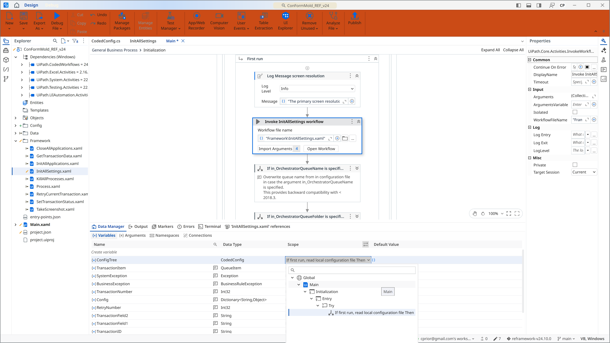

*Ensure the variable is scoped at the level like the others.*

### R#039 — seq 035

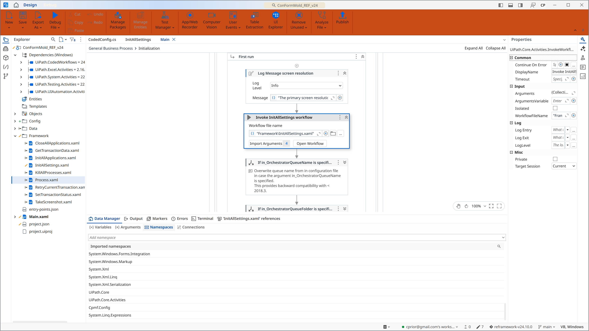

*"Open Process.xaml — the file where the actual work happens."*

### R#043 — seq 039

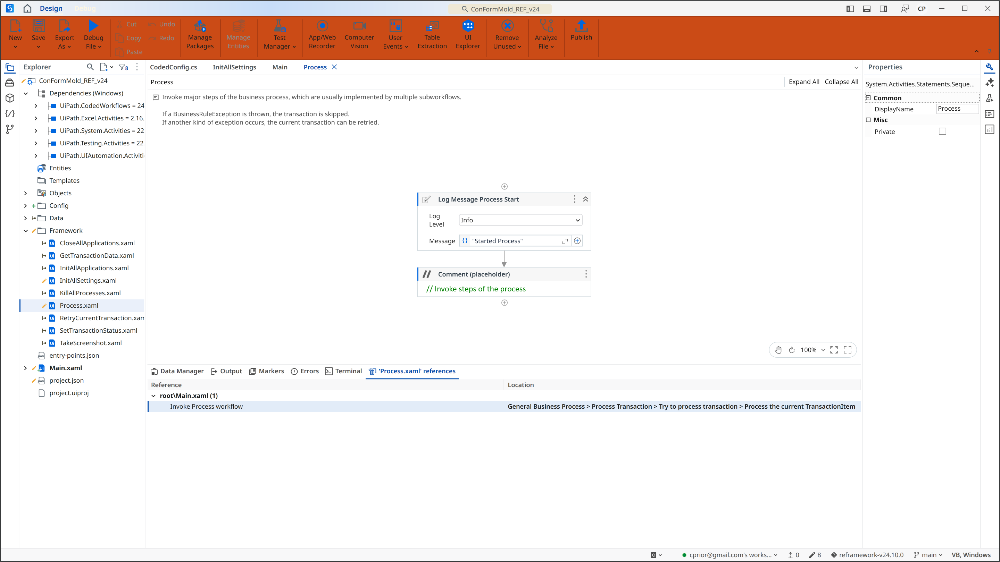

*Use the Project panel to find the references of `Process.xaml`.*

### R#045 — seq 041

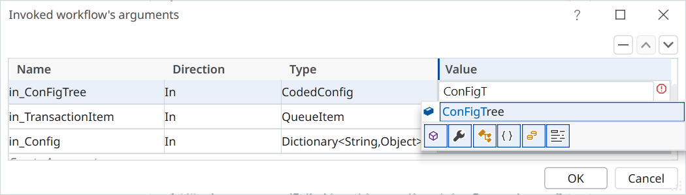

*Set the already-created variable `ConFigTree` to be passed into `Process.xaml`.*

### R#049 — seq 044

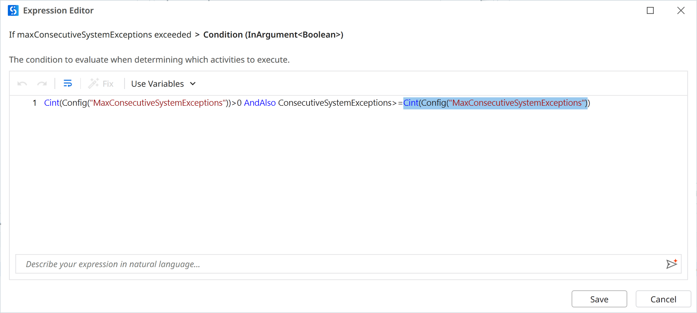

*Search in the project for an existing config item, like `maxConsecutiveSystemExceptions`.*

### R#050 — seq 045

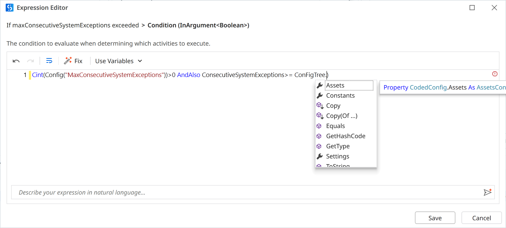

*Identify a nested casted use of a config item.*

### R#051 — seq 046

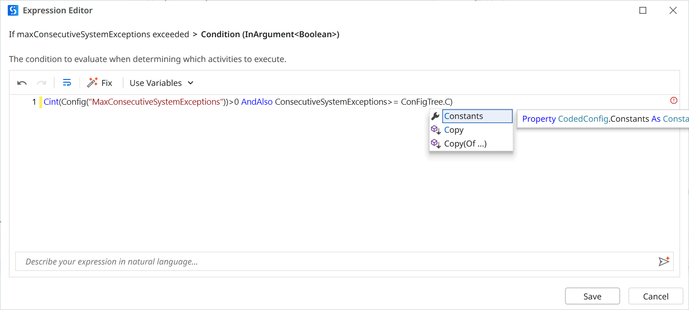

*Type the name of the coded config variable, followed by a dot, and watch its sections appear.*

### R#052 — seq 047

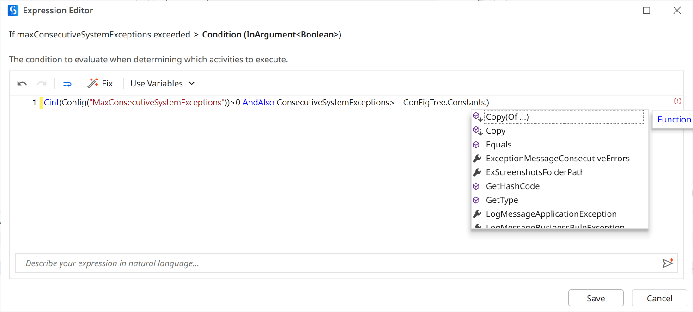

*Select `Constants`, like the sheet name in REFramework's `Config.xlsx`.*

### R#053 — seq 048

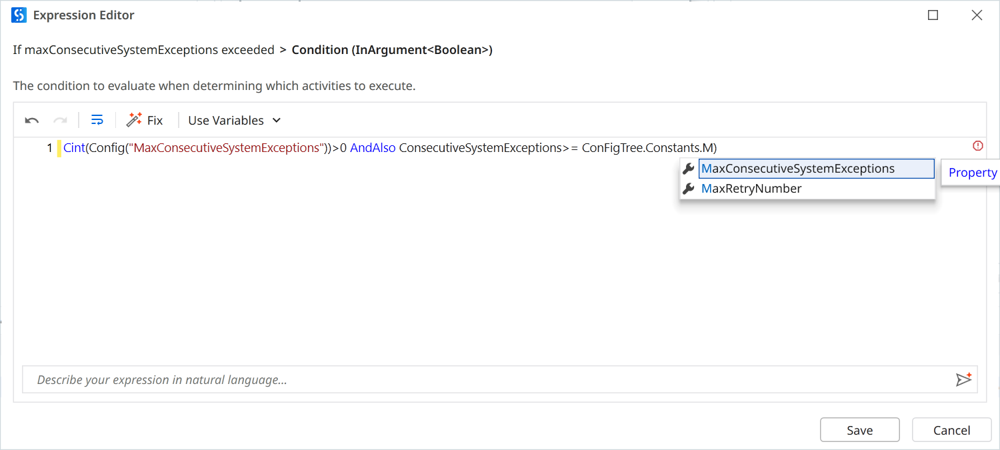

*Type a dot and watch the properties appear.*

### R#054 — seq 049

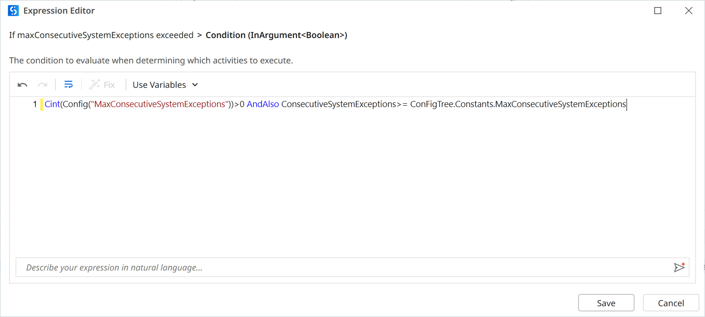

*Identify the config item by the property name.*

### R#055 — seq 050

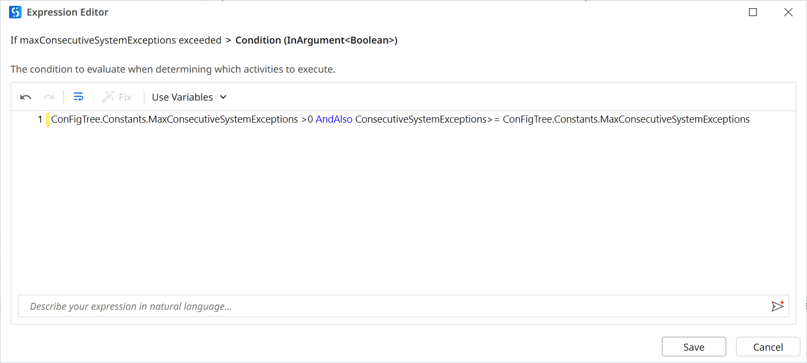

*This is guaranteed to be an Integer.*

### R#056 — seq 051

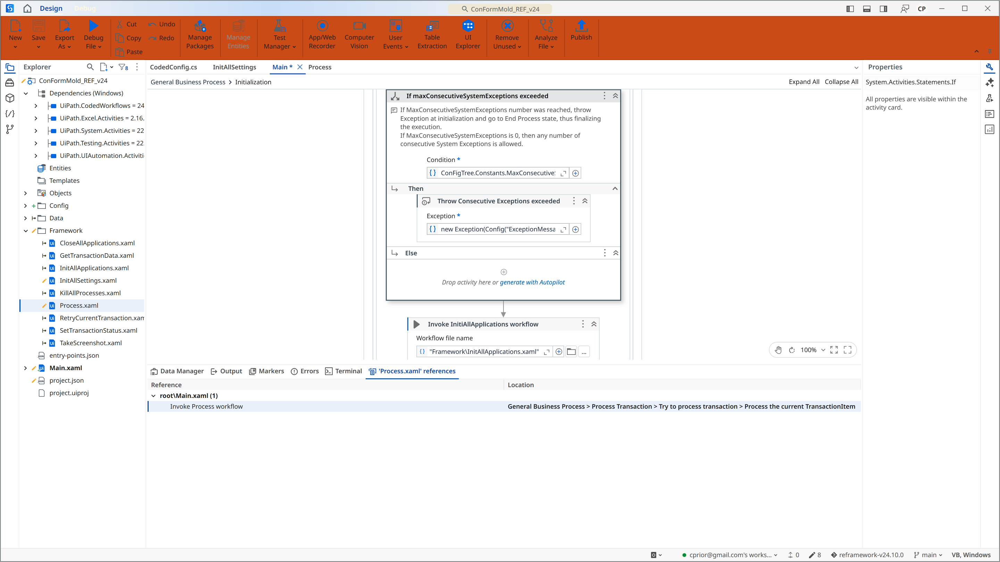

*Also replace the other use of the config item.*

