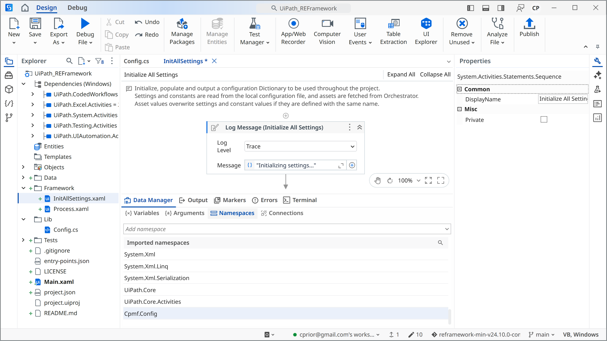
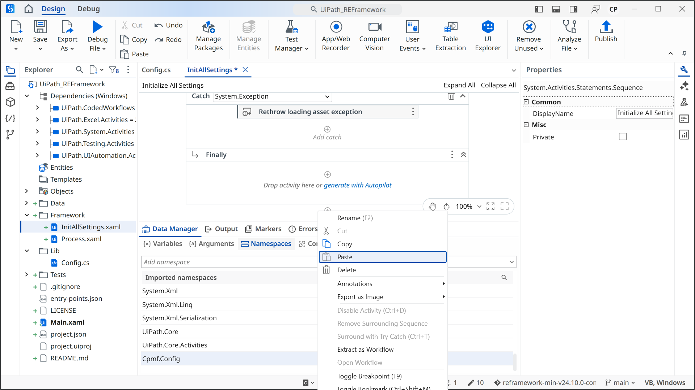

# Getting Started

ConFigTree turns a Config.xlsx into a typed C# class and a ready-to-paste XAML snippet for UiPath Studio. No installation. No build step on your machine. Open the browser tool, drop the file, paste into Studio.

This page walks through the complete path — from the browser to a running REFramework project.

---

## What you need

- A REFramework project open in UiPath Studio (2023.10.12 or later)
- Your project's `Config.xlsx` (or the sample from [[Sample Files|Developer-Samples]])
- The `UiPath.CodedWorkflows` package available on your feed

---

## 1. Generate the class and snippet

Open [configtree.cprima.net](https://configtree.cprima.net/) and drop your `Config.xlsx` onto the drop zone.

<!-- SCREENSHOT: Drop zone with Config.xlsx loaded — sheet checkboxes visible, C# tab active -->

The **C# class** tab shows the generated `.cs` file. Scan it to confirm the class name, namespace, and properties look right. This is the file that will be compiled into your project.

Switch to the **XAML snippet** tab.

<!-- SCREENSHOT: XAML snippet tab active — snippet visible in the code panel -->

If you want a different variable name than `out_ConFigTree`, change **Variable name** in the UiPath section of the sidebar now — the snippet updates immediately.

Click **Copy**.

---

## 2. Add the UiPath.CodedWorkflows dependency

In Studio, open **Manage Packages** and install `UiPath.CodedWorkflows` from the official feed.

This package enables coded workflows and is required for the C# class to compile inside the Studio project.

> ConFigTree is known to work with UiPath Studio **2023.10.12 and later**. Earlier patch releases in the 2023.10 line may not behave correctly.

---

## 3. Download the C# file

Switch back to the **C# class** tab and click **Download**. Save the file as `Config.cs` (or the filename shown in Settings) into your REFramework project's `Lib/` folder.

<!-- SCREENSHOT: C# tab with Download button highlighted — filename shown in sidebar -->

> **`Lib/` is a convention, not a requirement.** Studio picks up `.cs` files from anywhere inside the project folder — the root, a `Lib/` subfolder, a `CodedWorkflows/` subfolder, wherever makes sense for your project structure. Drop the file wherever your team keeps shared code.

---

## 4. Import the namespace

Open Framework/InitAllSettings.xaml. Open the **Imports** panel in Studio and add the namespace from your generated class — by default `Cpmf.Config`.

Importing the namespace also pulls in the assembly reference. Studio resolves the class from `Config.cs` in `Lib/`.

---

## 5. Paste the snippet into InitAllSettings

Open `Framework/InitAllSettings.xaml`. Scroll to the bottom of the sequence, click after the last activity to place the cursor there, then press **Ctrl+V**.

The pasted activities include:
- A `ForEach` loop that reads each config sheet into a `Dictionary<string, DataTable>`
- An `Assign` that calls `CodedConfig.Load(dt_Tables)` and stores the result in `out_ConFigTree`
- (If your config has asset sheets) A `ForEach` over `GetAllAssets()` with one `GetRobotAsset` call per asset

---

## 6. Convert the variable to an argument

The pasted snippet introduces a local variable `out_ConFigTree` typed as `Object`. You need to promote it to an `Out` argument so it flows back to the caller.

In the **Variables** panel, right-click `out_ConFigTree` and choose **Convert to Argument**.

<!-- SCREENSHOT: Variables panel — right-click context menu with "Convert to Argument" highlighted -->

Studio creates the argument but gets two things wrong:
- Direction is set to `In` — change it to **Out**
- Type is set to `Object` — change it to **CodedConfig** (select from the `Cpmf.Config` namespace)

> **Why Studio does this**: "Convert to Argument" always creates `InArgument(Object)` regardless of the variable's inferred type. This is a known Studio behaviour — the correction is manual and takes about ten seconds.

---

## 7. Wire up the argument in the calling workflow

Right-click `InitAllSettings.xaml` in the Project panel and choose **Find References**. This shows every workflow that invokes it — typically `Main.xaml` and `Process.xaml`.

For each reference:

1. Open the calling workflow
2. Create a variable of type `CodedConfig` (from `Cpmf.Config`) — for example `v_ConFigTree` in `Main.xaml`
3. Import the `Cpmf.Config` namespace in that workflow's Imports panel
4. On the `InvokeWorkflowFile` activity for `InitAllSettings`, open **Import Arguments** and map `out_ConFigTree` → `v_ConFigTree`

<!-- SCREENSHOT: Main.xaml — InvokeWorkflowFile for InitAllSettings with Import Arguments open, out_ConFigTree mapped to v_ConFigTree -->

To pass the loaded config into `Process.xaml`, add an `In` argument of type `CodedConfig` to `Process.xaml` and map it from the `InvokeWorkflowFile` in `Main.xaml`.

---

## 8. Verify Project

Press **Ctrl+Shift+E** (or click **Verify Project** in the ribbon). A clean verification with no errors confirms the integration is complete.

<!-- SCREENSHOT: Verification panel showing no errors -->

If you see errors at this stage, see [[Troubleshooting]].

---

## What's next

- [[Config.xlsx and Beyond|Excel-Format]] — sheet types, column formats, dot-prefix exclusions
- [[Coded, and Typed|Coded-and-Typed]] — why a typed class is better than the Config dictionary
- [[The Dual Way|The-Dual-Way]] — keep the old `out_Config` dictionary alongside `out_ConFigTree` during migration
- [[Settings and Opinionated|Configuration]] — all sidebar settings and feature toggles
