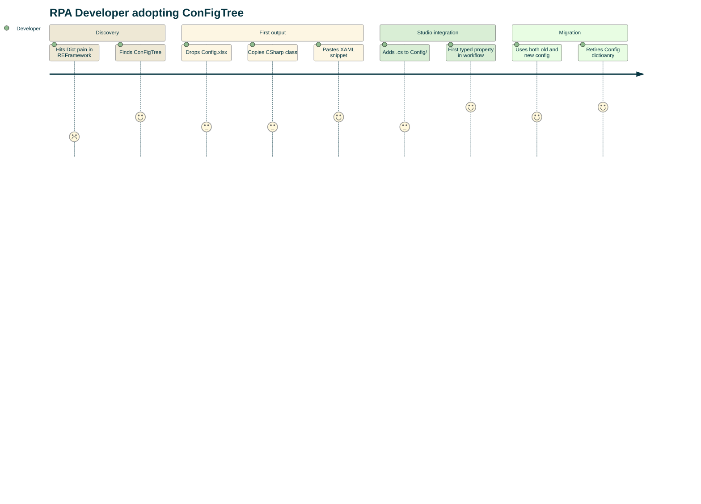

<!-- Home -->
<!-- Summary: Public landing page for ConFigTree with a short product pitch and links into the user-facing docs. -->

**Drop the Dict! Your Config deserves better.**

ConFigTree is a browser-based tool that generates typed C# configuration classes from structured data files (Excel, JSON, TOML, YAML) for use in UiPath REFramework projects.

Use it when you want configuration that is explicit, typed, and easier to keep in sync with your REFramework project.

## Benefits

1. It was never so easy to navigate your configuration!

2. If you keep .xlsx and CodedConfig in sync, then you will catch missing config items early!

3. Even your CI/CD pipeline will not publish a broken package!

## Start Here

- [[Getting Started|Getting-Started]] — generate your first typed config
- [[Excel Format|Excel-Format]] — understand the `.xlsx` contract
- [[TOML Format|TOML-Format]] — use TOML as an alternative input format
- [[XAML Snippet|XAML-Snippet]] — paste the generated loader into UiPath Studio

## Learn More

- [[Migration (Dual Mode)|Migration-Dual-Mode]] — keep dictionary and typed config side by side while migrating
- [[REFramework Configuration|REFramework-Config-Pain-and-Coded-Config-to-the-Rescue]] — how CodedConfig fits into REFramework
- [[Configuration]] — generator settings and feature toggles

## Live Tool

👉 [configtree.cprima.net](https://configtree.cprima.net/)

## Your Journey Ahead

