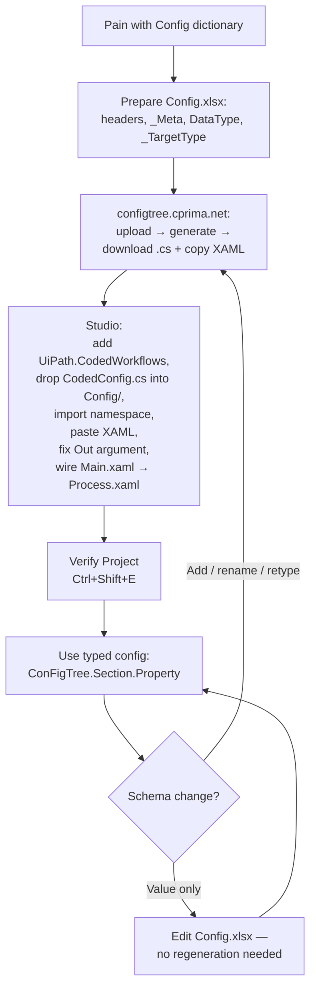

<!-- Journey into Coded Config -->
<!-- Summary: Narrative walkthrough of the adoption journey from REFramework dictionary config to typed config and its maintenance loop. -->

The web tool at [configtree.cprima.net](https://configtree.cprima.net/) is one step of a longer arc — from recognising a pain with the REFramework config dictionary, through Studio integration, to a maintenance loop that keeps the typed config in sync with your workflows.

This page maps the full journey. For step-by-step Studio mechanics with screenshots, see [[Getting Started|Getting-Started]].

## Phase 1 — Decide to adopt

**1. Hit the pain.** A typo in `in_Config("QueuName")` passes `Verify Project` and crashes in production. A refactor means touching 40 XAML expressions by hand. A Date cell returns `Nothing` from a dictionary cast. These are symptoms of the REFramework config dictionary's core problem — stringly-typed, runtime-only failure.

**2. Prepare your Config source.** REFramework's `Config.xlsx` already has the structure — `Settings`, `Constants`, and `Assets` sheets with their header rows. ConFigTree reads it as-is: cell types drive the C# types (`10` becomes `int`, `TRUE` becomes `bool`, a date cell becomes `DateOnly` / `DateTime` / `TimeOnly`).

Optional enhancements unlock more of ConFigTree's output:

- Add a `_Meta` sheet to pin `namespace` / `rootClassName` into the file itself
- Add a `DataType` column to any sheet to force a type (e.g. `double` for a whole-number default) or mark rows as `credential` / `asset` references — the generator then emits companion `…Folder` / `…Name` getters
- Add a `_TargetType` row to a section bound to a library type (emits a `ToSapConfig()` mapping method)

See [[Excel Format|Excel-Format]] for the full contract.

## Phase 2 — Generate on the webpage

Open [configtree.cprima.net](https://configtree.cprima.net/) and walk through the UI:

1. **Arrive.** Sidebar settings restore from localStorage — namespace, root class, .NET target, feature toggles.
2. **Configure (optional).** Tweak namespace, filename, or features. Settings persist on each change but do not auto-regenerate.
3. **Upload your file.** Drop your `Config.xlsx` onto the drop zone.
4. **Meta overlay applies.** If the workbook has a `_Meta` sheet, those values overlay the sidebar.
5. **Sheet picker appears.** One checkbox per section; asset sheets get an `asset` badge; parser warnings surface as orange alerts.
6. **Auto-generate.** C# fills the output tab; XAML tab becomes enabled.
7. **Refine.** Uncheck sheets or change settings, then click **Regenerate**.
8. **Export.**
   - **Copy** the XAML snippet.
   - **Download** the `.cs` file.

Two artefacts leave the browser:
- `CodedConfig.cs` (downloaded) — strongly-typed class hierarchy
- **XAML ClipboardData** (on clipboard) — ready-to-paste `Sequence` of activities

## Phase 3 — Install into the UiPath Studio project

Prerequisites: UiPath Studio **2023.10.12 or later**, a REFramework project.

**3. Add the `UiPath.CodedWorkflows` package.** Manage Packages → official feed → install. Without this the `.cs` file will not compile inside Studio.

**4. Drop `CodedConfig.cs` into the project.** Convention is `Config/CodedConfig.cs`, but anywhere inside the project folder works — Studio picks up `.cs` files regardless of path.

**5. Import the namespace.** Open `Framework/InitAllSettings.xaml` → **Imports** panel → add `Cpmf.Config` (or whatever namespace the sidebar produced). Studio resolves the assembly reference automatically.

**6. Paste the XAML snippet.** Scroll to the bottom of `InitAllSettings.xaml`, click after the last activity, press **Ctrl+V**. The clipboard places:

- A `ForEach` that reads every config sheet into a `Dictionary<string, DataTable>`
- An `Assign` that calls `CodedConfig.Load(tables)`
- (If your config has asset sheets) a second `ForEach` issuing one `GetRobotAsset` per asset

**7. Promote `out_ConFigTree` to an Out argument.** The pasted snippet declares it as a local `Object` variable. Studio's **Convert to Argument** is buggy — it creates `InArgument(Object)`. Fix manually:

- Direction → **Out**
- Type → **CodedConfig** (from the `Cpmf.Config` namespace)

**8. Wire the argument through `Main.xaml` and `Process.xaml`.** Find References on `InitAllSettings.xaml`. For each caller:

- Create a `CodedConfig` variable (e.g. `v_ConFigTree` in `Main.xaml`)
- Import the `Cpmf.Config` namespace
- On the `InvokeWorkflowFile` activity, open **Import Arguments** and map `out_ConFigTree` → `v_ConFigTree`

Add an `In` argument of type `CodedConfig` to `Process.xaml` and map it in from `Main.xaml`.

**9. Verify Project (Ctrl+Shift+E).** A clean pass means the integration is done. Errors here mean a missing import, wrong argument direction, or a namespace mismatch — see [[Troubleshooting]].

## Phase 4 — Use the typed config in workflows

**10. Replace dictionary lookups.**

```
in_Config("MaxRetries").ToString   →   ConFigTree.Settings.MaxRetries
CBool(in_Config("IsEnabled"))      →   ConFigTree.Settings.IsEnabled
CDate(in_Config("CutoffDate"))     →   ConFigTree.Settings.CutoffDate
```

IntelliSense works, types are enforced at compile time, typos block Verify Project.

**11. Use target-type mapping methods.** If a section carried `_TargetType`, call the generated `ToXxx()` method to produce a library-native type instead of hand-building one:

```
ConFigTree.Sap.ToSapConfig()   →   CPMForge.SAP.SapConfig
```

Pass the result straight into library activities (e.g. `SapLogon`).

**12. Use credential and asset shortcuts.**

- `ConFigTree.Settings.SapCredentialFolder` / `.SapCredentialName` — no manual `Split('/')` at the call site.
- Asset properties are already populated by the `GetRobotAsset` block the snippet pasted into `InitAllSettings.xaml`.

## Phase 5 — Maintenance loop

**13. Add a property.** Add a row to `Config.xlsx` → regenerate on the webpage → **Download** over the existing `Config/CodedConfig.cs` → Studio hot-reloads → the new property is available everywhere.

**14. Rename a property.** Same loop. The win: Studio now shows **compile-time errors** at every old usage. Failures you'd previously discover in production now block Verify Project.

**15. Change a type.** Same loop. `int → double` or `string → DateOnly` surfaces downstream expressions that silently coerced — they now fail Verify Project.

**16. Commit both artefacts.** Version-control both `Config.xlsx` (the source) and `Config/CodedConfig.cs` (the generated contract). The XAML snippet is **not** stored — it is regenerated on demand from the webpage.

## Values vs schema

An important distinction:

| Change | What to do |
|---|---|
| Edit a **value** in the xlsx (`MaxRetries: 3 → 5`) | Save the xlsx. The runtime loader reads the cell at every Load. No regeneration needed. |
| Add / rename / retype a **property** (schema change) | Regenerate `CodedConfig.cs` from the webpage; Studio picks up the change on rebuild. |

Regeneration is only needed when the **shape** changes, not when values change.

## Full journey at a glance


