<!-- Mermaid Diagrams -->
<!-- Summary: Unlisted exploration page that collects candidate Mermaid diagrams for the wiki and product story. -->

Unlisted page. 12 diagram candidates across different Mermaid types.
Not linked from the sidebar.

---

## 1. System Overview

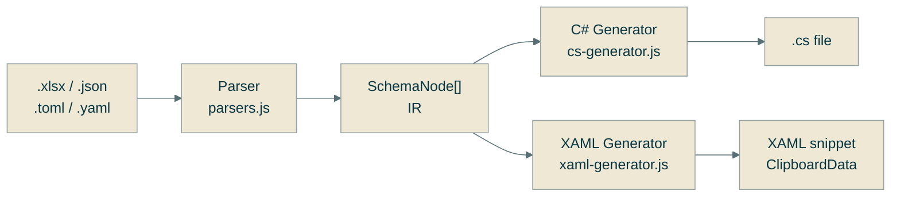

---

## 2. Format Dispatch

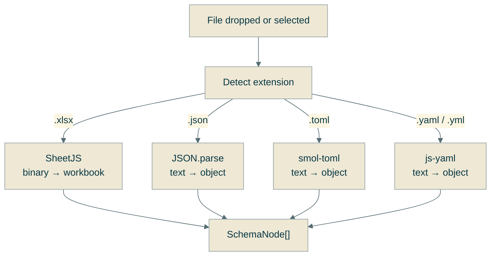

---

## 3. SchemaNode IR

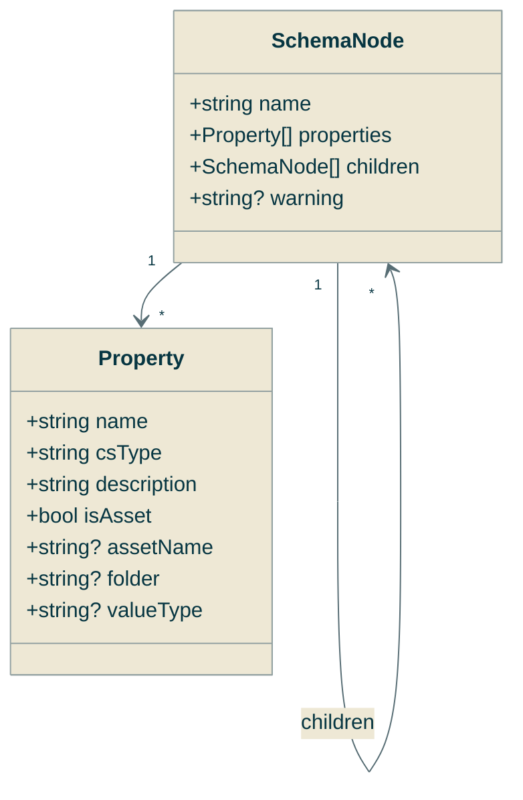

---

## 4. Migration (Dual Mode)

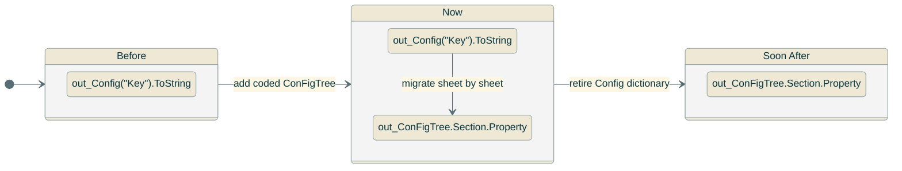

---

## 5. REFramework Integration Sequence

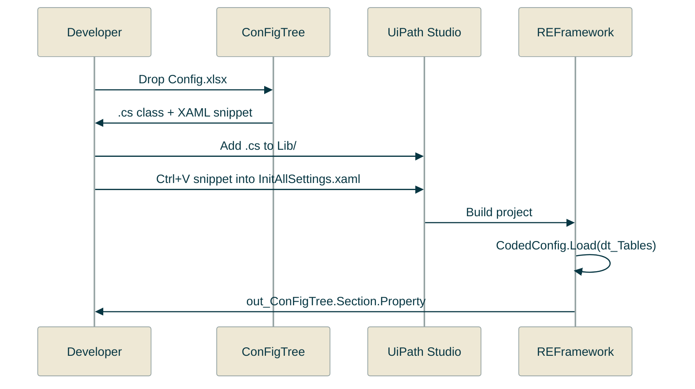

---

## 6. Excel Workbook Structure

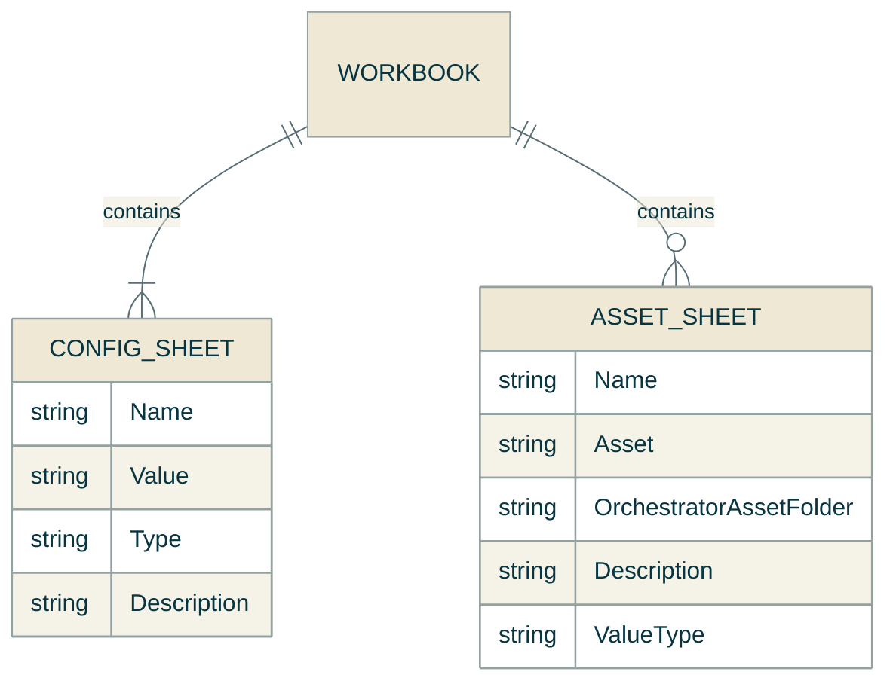

---

## 7. Generated C# Class Structure

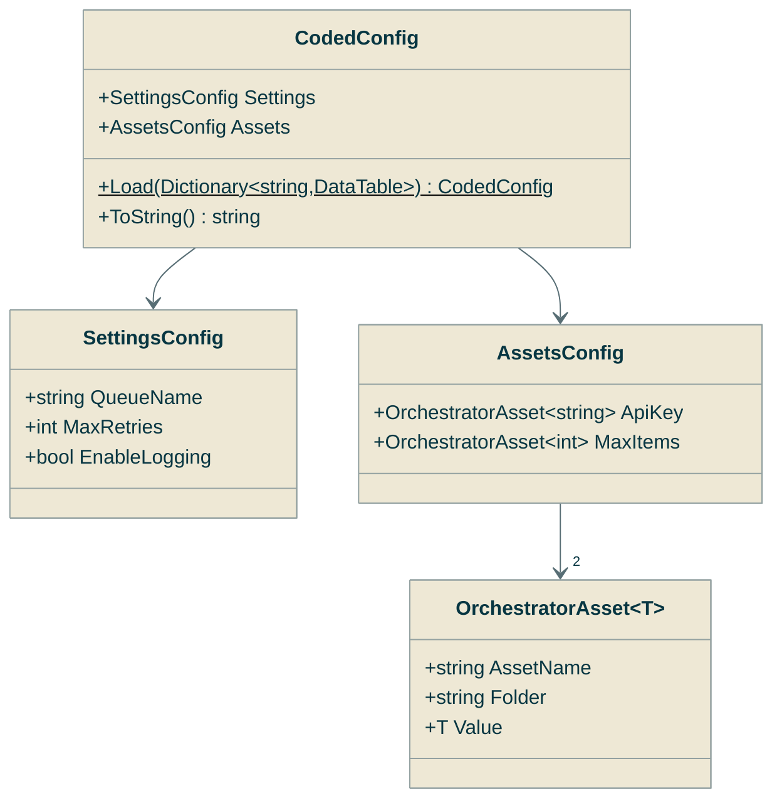

---

## 8. Settings Mind Map

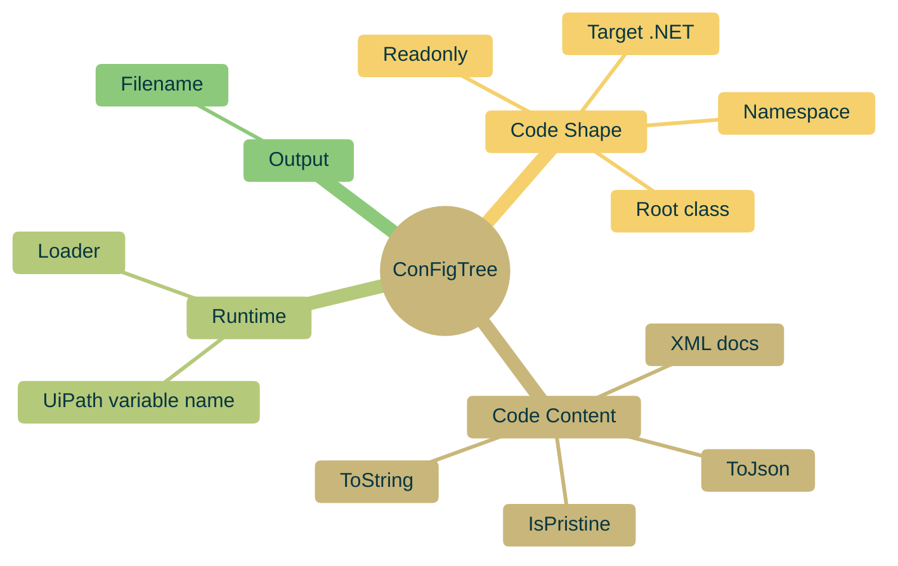

---

## 9. Asset Loading Sequence

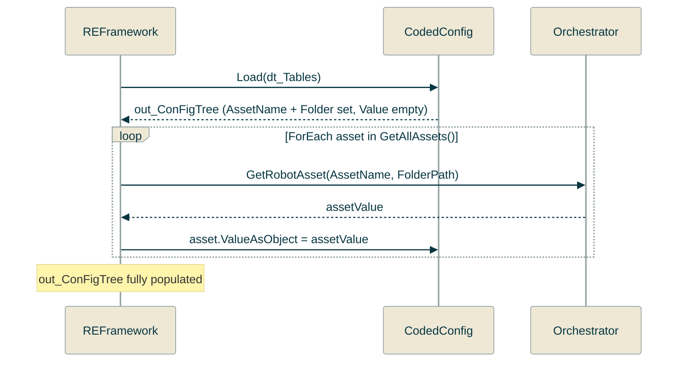

---

## 10. Deployment Pipeline

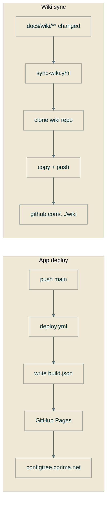

---

## 11. Wiki Authoring Flow

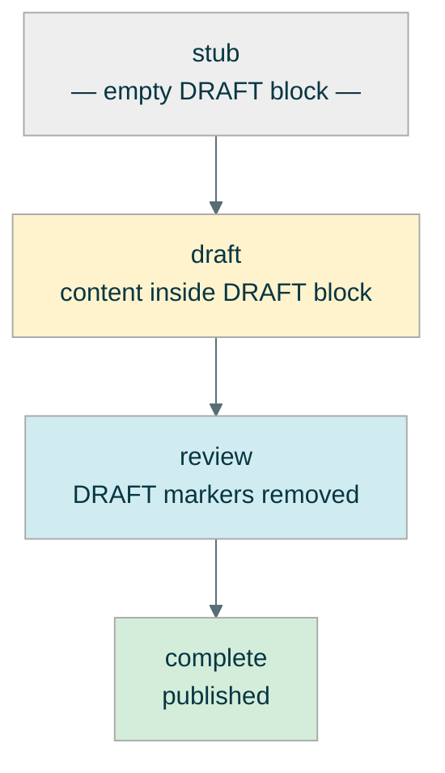

---

## 12. RPA Developer Journey

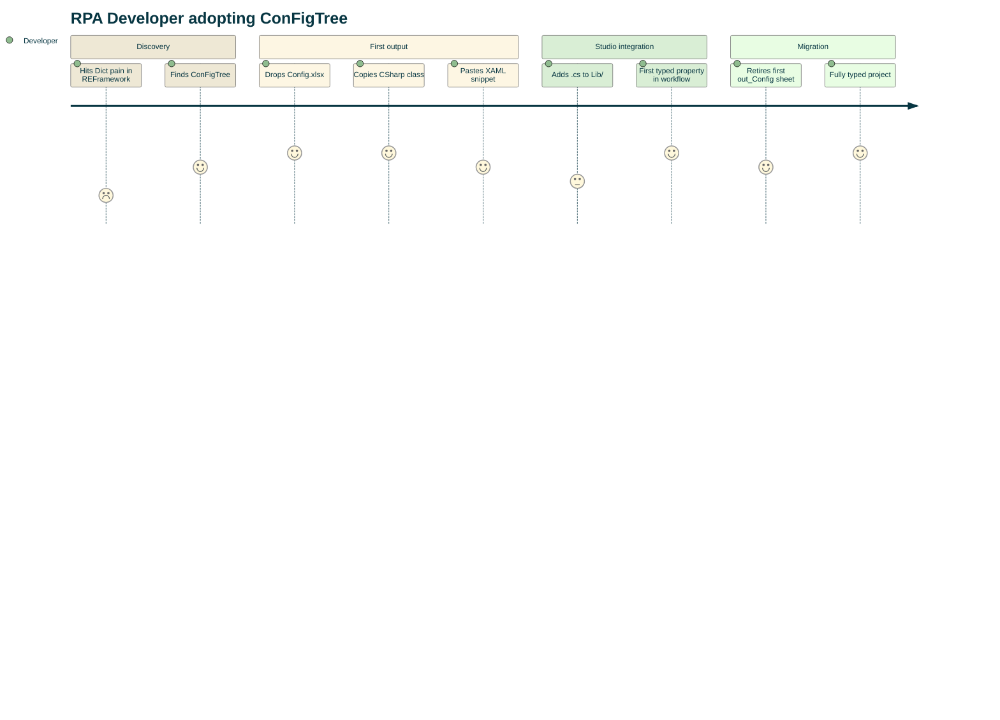
