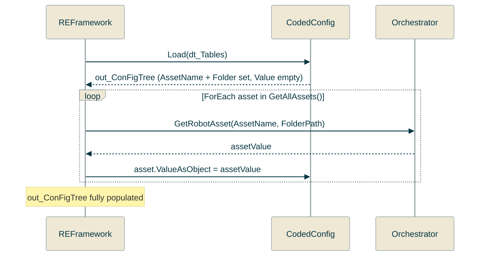

<!-- XAML Snippet -->
<!-- Summary: Explains the generated UiPath clipboard snippet, what it contains, and how to paste it into InitAllSettings.xaml. -->

The **XAML snippet** tab generates a UiPath Studio clipboard snippet that wires the generated C# class into your REFramework project.

## What it contains

For `.xlsx` sources with the Loader feature enabled, the snippet contains:

1. A `ForEach` loop that reads each config sheet into a `Dictionary<string, DataTable>`
2. An `Assign` activity that calls `YourClass.Load(dt_Tables)` and assigns the result to the configured variable
3. (If asset sheets are present) A `ForEach` loop over `GetAllAssets()` with a `GetRobotAsset` call per asset

For non-Excel sources (JSON, TOML, YAML), a single `Assign` with the appropriate `LoadJson` / `LoadToml` / `LoadYaml` method is generated.

## How to paste into Studio

1. Switch to the **XAML snippet** tab in ConFigTree
2. Click **Copy**
3. In UiPath Studio, open `Framework/InitAllSettings.xaml`
4. Click inside the workflow canvas
5. Press **Ctrl+V** — the activities paste directly from the clipboard

## Variable name

The variable name in the snippet is controlled by the **Variable name** setting in the UiPath section of the sidebar. Default: `out_ConFigTree`.

By default, the Clipboard snippet will only create a variable of type `Object`. This must be one-time converted to an aout argument of the type `CodedConfig`.

## Requirements

- UiPath Studio 2023.10 or later
- REFramework project (Windows or Windows-Legacy)
- The generated `.cs` file added to the project's `Config/` folder and compiled
